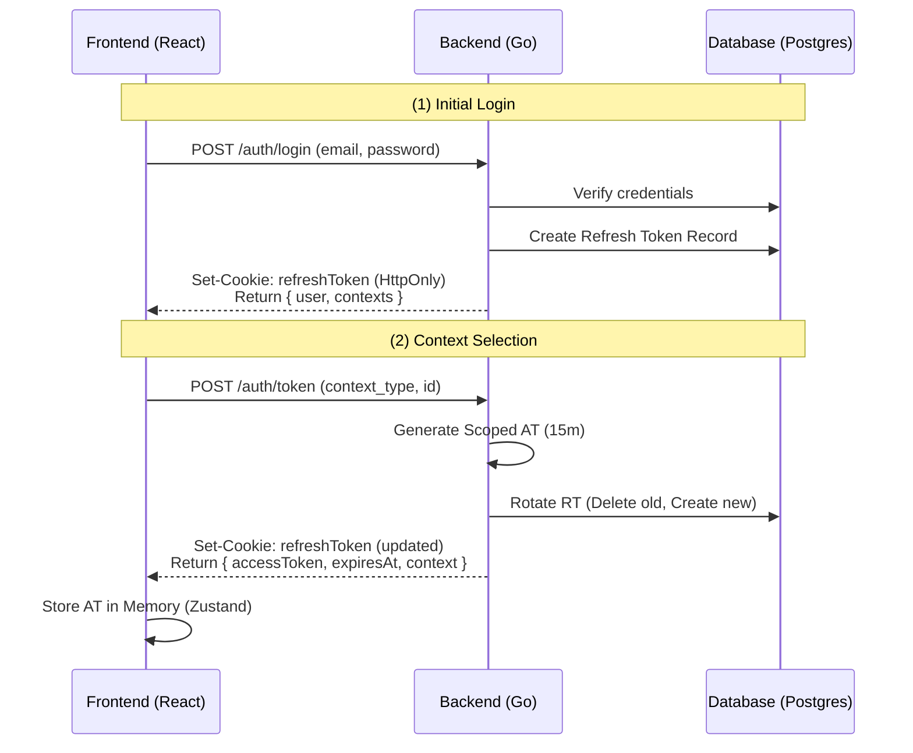
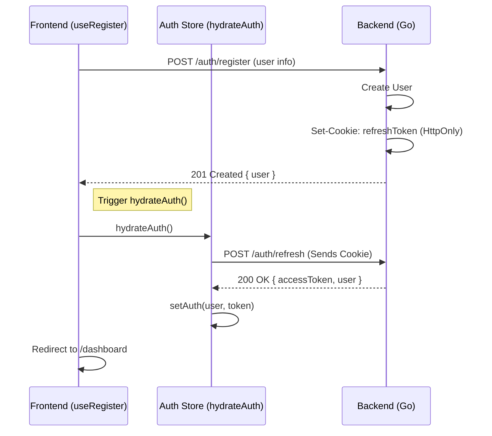
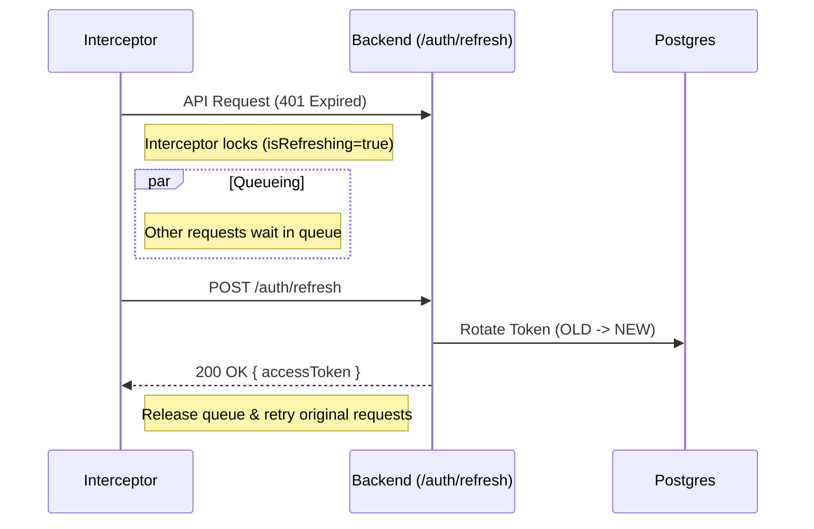
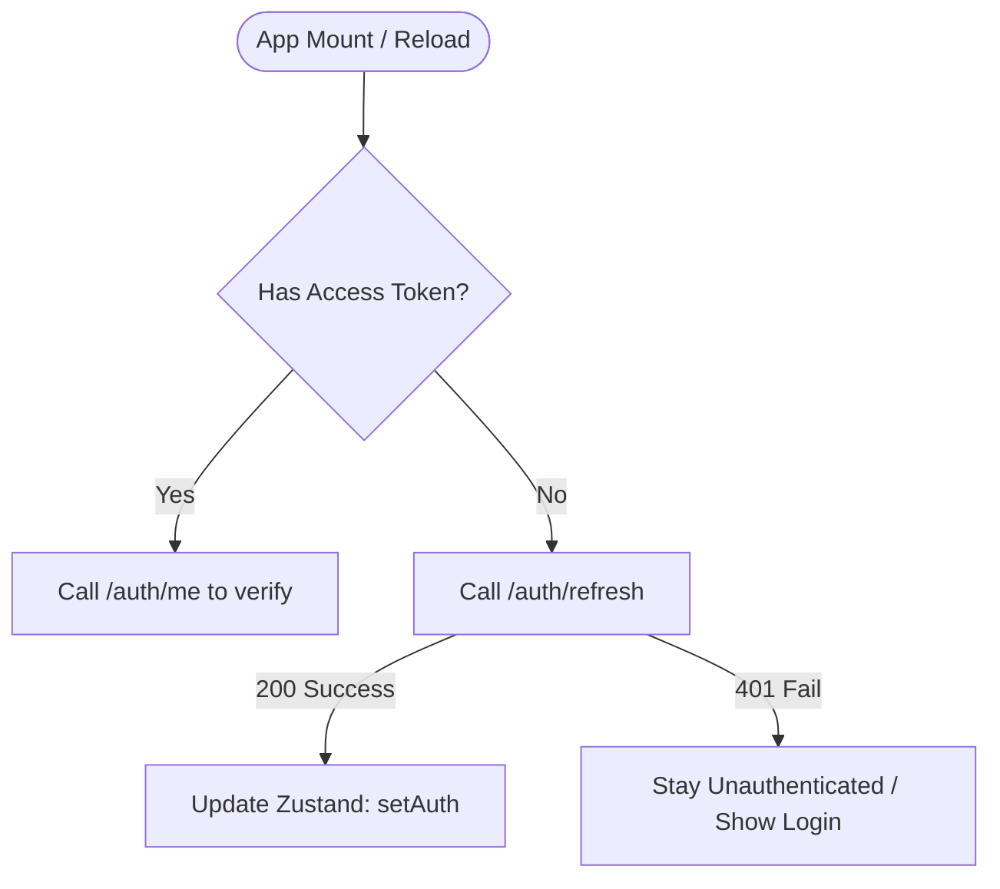
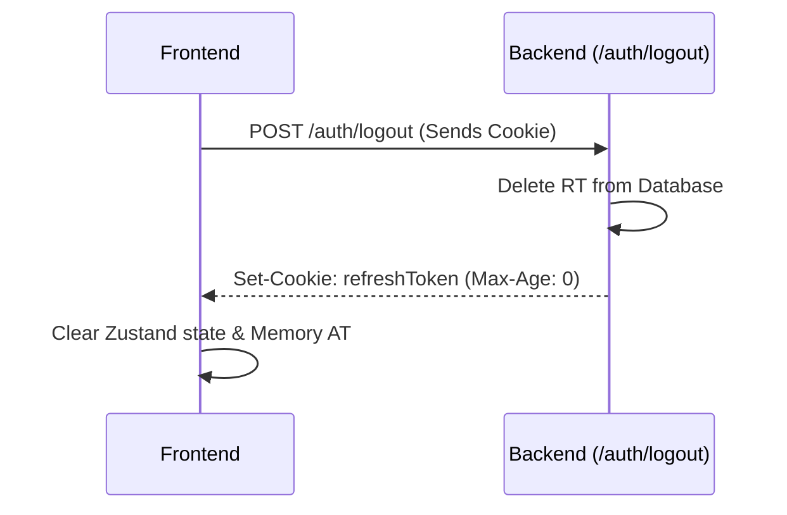

# Authentication Flow Specification (AT + RT)

This document outlines the production-grade authentication and authorization flow used in SmartDorm, utilizing short-lived **Access Tokens (AT)** and long-lived **Refresh Tokens (RT)** with rotation.

## 1. Architectural Overview

| Component | Storage | Purpose | Security |
| :--- | :--- | :--- | :--- |
| **Access Token (AT)** | Memory (JS State) | Scoped API authorization | Short-lived (15m), protected from XSS. |
| **Refresh Token (RT)** | HttpOnly Cookie | Session maintenance | Secure, HttpOnly, SameSite=Lax, Path-restricted. |
| **User State** | Zustand Store | UI reactivity | Hydrated via `hydrateAuth()` method. |

---

## 2. Authentication Flows

### 2.1 Initial Login & Context Selection
Requires credential verification followed by a scoped context choice.

### 2.2 Automatic Login after Registration
Registration immediately issues a session cookie, followed by a silent refresh to get the Access Token.

### 2.3 Token Refresh Flow (Queued)
Handles AT expiration seamlessly via an Axios interceptor with a wait-queue.

### 2.4 Silent Refresh (App Reload)
Ensures the session persists across page reloads without storing the AT in `localStorage`.

### 2.5 Secure Logout
Revokes the session on both the client (cookie clear) and server (DB record deletion).

---

## 3. Security Implementation Details

### 3.1 Token Rotation & Reuse Detection
Whenever a `refreshToken` is used, the backend invalidates it and issues a new one.
- **Breach Detection**: If an old (used) RT is presented, the server revokes **all** active sessions for that user to mitigate potential leaks.

### 3.2 HttpOnly Cookie Configuration
The `refreshToken` is never accessible via JavaScript, mitigating **XSS** risks.

### 3.3 Memory Isolation
The `accessToken` is stored in the `authStore` (Zustand) and **explicitly excluded** from the persistence layer (`localStorage`).

---

## 4. Error Handling & Fallbacks

- **401 Unauthorized**: Handled by interceptor. Triggers refresh.
- **403 Forbidden**: Token valid, but insufficient permissions/context.
- **Refresh Failed**: Full logout triggered, redirect to `/login`.
